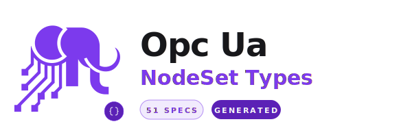

<h1 align="center"><strong>OPC UA NodeSet Types</strong></h1>

<div align="center">
  <picture>
    <source media="(prefers-color-scheme: dark)" srcset="assets/logo-dark.svg">
    <source media="(prefers-color-scheme: light)" srcset="assets/logo-light.svg">
    
  </picture>
</div>

<p align="center">
  <a href="https://packagist.org/packages/php-opcua/opcua-client-nodeset"></a>
  <!-- <a href="https://packagist.org/packages/php-opcua/opcua-client-nodeset"></a> -->
  <a href="https://packagist.org/packages/php-opcua/opcua-client-nodeset"></a>
  <a href="LICENSE"></a>
</p>

---

Pre-generated PHP classes from the [OPC Foundation UA-Nodeset](https://github.com/OPCFoundation/UA-Nodeset) companion specifications, for use with [`php-opcua/opcua-client`](https://github.com/php-opcua/opcua-client).

**807 PHP files** across **51 companion specifications** — NodeId constants, PHP enums, typed DTOs, binary codecs, and registrars with automatic dependency resolution. Zero configuration, just `composer require` and load.

## Versioning

This library follows the versioning of [`php-opcua/opcua-client`](https://github.com/php-opcua/opcua-client). Major and minor versions are kept in sync to ensure compatibility.

## Installation

```bash
composer require php-opcua/opcua-client-nodeset
```

Requires `php-opcua/opcua-cli` ^4.0.

## Quick Start

```php
use PhpOpcua\Client\ClientBuilder;
use PhpOpcua\Nodeset\Robotics\RoboticsRegistrar;
use PhpOpcua\Nodeset\Robotics\RoboticsNodeIds;
use PhpOpcua\Nodeset\Robotics\Enums\OperationalModeEnumeration;

$client = ClientBuilder::create()
    ->loadGeneratedTypes(new RoboticsRegistrar())  // loads DI + IA dependencies automatically
    ->connect('opc.tcp://192.168.1.100:4840');

// Enum values are auto-cast to PHP BackedEnum
$mode = $client->read(RoboticsNodeIds::OperationalMode)->getValue();
// OperationalModeEnumeration::MANUAL_REDUCED_SPEED (not int 1)

if ($mode === OperationalModeEnumeration::MANUAL_HIGH_SPEED) {
    echo "Robot in manual high speed mode\n";
}
```

## What's Generated

Each companion specification produces up to 5 types of PHP files:

### NodeId Constants

String constants for every node in the specification — ready for `read()`, `write()`, `browse()`:

```php
use PhpOpcua\Nodeset\DI\DINodeIds;

$value = $client->read(DINodeIds::DeviceType)->getValue();
```

### PHP Enums

`BackedEnum` classes for OPC UA enumeration types:

```php
use PhpOpcua\Nodeset\Robotics\Enums\MotionDeviceCategoryEnumeration;

$category = MotionDeviceCategoryEnumeration::ARTICULATED_ROBOT; // int 1
```

When loaded via `loadGeneratedTypes()`, reading an enum node returns the PHP enum directly instead of a raw `int`.

### Typed DTOs

Readonly classes with typed properties for structured data types:

```php
$data = $client->read(DINodeIds::SomeStructuredNode)->getValue();
$data->Manufacturer;   // string
$data->SerialNumber;   // string
$data->Status;         // PHP enum (auto-cast)
```

Enum fields within structures are typed with the generated enum class. Array fields use `array` type. Optional fields are nullable.

### Binary Codecs

`ExtensionObjectCodec` implementations that decode/encode OPC UA binary data into the typed DTOs. Registered automatically via the Registrar.

### Registrar

Each specification has a Registrar implementing `GeneratedTypeRegistrar`:

```php
use PhpOpcua\Nodeset\MachineTool\MachineToolRegistrar;

$client = ClientBuilder::create()
    ->loadGeneratedTypes(new MachineToolRegistrar())
    ->connect('opc.tcp://192.168.1.100:4840');
```

## Automatic Dependency Resolution

OPC UA companion specifications often depend on each other. When you load a Registrar, its dependencies are loaded automatically:

```php
// Loading MachineTool automatically loads: Machinery, DI, IA
$client = ClientBuilder::create()
    ->loadGeneratedTypes(new MachineToolRegistrar())
    ->connect('opc.tcp://192.168.1.100:4840');
```

To load only the specification itself without dependencies:

```php
$client = ClientBuilder::create()
    ->loadGeneratedTypes(new MachineToolRegistrar(only: true))
    ->connect('opc.tcp://192.168.1.100:4840');
```

## Loading Multiple Specifications

Stack multiple registrars on the builder — duplicates are handled gracefully:

```php
$client = ClientBuilder::create()
    ->loadGeneratedTypes(new DIRegistrar())
    ->loadGeneratedTypes(new RoboticsRegistrar())
    ->loadGeneratedTypes(new MachineToolRegistrar())
    ->connect('opc.tcp://192.168.1.100:4840');
```

## Backward Compatibility

Loading generated types is completely opt-in. Without `loadGeneratedTypes()`, everything works exactly as before — raw `int` values, array-based structures, no type wrapping.

## Available Specifications

| Specification | Namespace | Enums | Types | Codecs |
|---|---|---|---|---|
| ADI (Analytical Devices) | `PhpOpcua\Nodeset\ADI` | 3 | — | — |
| AMB (Asset Management) | `PhpOpcua\Nodeset\AMB` | 1 | 2 | 2 |
| AML (Automation ML) | `PhpOpcua\Nodeset\AML` | — | — | — |
| AutoID | `PhpOpcua\Nodeset\AutoID` | 6 | 19 | 19 |
| BACnet | `PhpOpcua\Nodeset\BACnet` | 36 | 44 | 44 |
| CAS (Compressed Air Systems) | `PhpOpcua\Nodeset\CAS` | 23 | 1 | 1 |
| CNC | `PhpOpcua\Nodeset\CNC` | 6 | 1 | 1 |
| Commercial Kitchen Equipment | `PhpOpcua\Nodeset\CommercialKitchenEquipment` | 24 | — | — |
| Cranes & Hoists | `PhpOpcua\Nodeset\CranesHoists` | 4 | — | — |
| CSPPlusForMachine | `PhpOpcua\Nodeset\CSPPlusForMachine` | — | — | — |
| Cutting Tool | `PhpOpcua\Nodeset\CuttingTool` | — | 1 | 1 |
| DEXPI (Process Industry) | `PhpOpcua\Nodeset\DEXPI` | 29 | — | — |
| DI (Device Integration) | `PhpOpcua\Nodeset\DI` | 8 | 11 | 11 |
| ECM (Energy Consumption) | `PhpOpcua\Nodeset\ECM` | 1 | 5 | 5 |
| FDI (Field Device Integration) | `PhpOpcua\Nodeset\FDI` | 3 | 6 | 6 |
| FDT (Field Device Tool) | `PhpOpcua\Nodeset\FDT` | 11 | 3 | 3 |
| GDS (Global Discovery) | `PhpOpcua\Nodeset\GDS` | — | 1 | 1 |
| GPOS (Global Positioning) | `PhpOpcua\Nodeset\GPOS` | — | 4 | 4 |
| I4AAS (Industry 4.0 Asset Admin Shell) | `PhpOpcua\Nodeset\I4AAS` | 10 | 1 | 1 |
| IA (Industrial Automation) | `PhpOpcua\Nodeset\IA` | 4 | 1 | 1 |
| IOLink | `PhpOpcua\Nodeset\IOLink` | 1 | — | — |
| IREDES (Mining) | `PhpOpcua\Nodeset\IREDES` | 5 | 2 | 2 |
| ISA-95 | `PhpOpcua\Nodeset\ISA95` | 1 | 4 | 4 |
| LADS (Laboratory Devices) | `PhpOpcua\Nodeset\LADS` | 1 | 2 | 2 |
| Laser Systems | `PhpOpcua\Nodeset\LaserSystems` | — | — | — |
| Machinery | `PhpOpcua\Nodeset\Machinery` | — | — | — |
| MachineTool | `PhpOpcua\Nodeset\MachineTool` | 10 | — | — |
| MachineVision | `PhpOpcua\Nodeset\MachineVision` | 2 | 14 | 14 |
| MDIS (Marine & Subsea) | `PhpOpcua\Nodeset\MDIS` | 12 | 1 | 1 |
| Metal Forming | `PhpOpcua\Nodeset\MetalForming` | — | 2 | 2 |
| MTConnect | `PhpOpcua\Nodeset\MTConnect` | 25 | 3 | 3 |
| Onboarding | `PhpOpcua\Nodeset\Onboarding` | — | 6 | 6 |
| PackML (Packaging) | `PhpOpcua\Nodeset\PackML` | 1 | 6 | 6 |
| PADIM (Process Automation) | `PhpOpcua\Nodeset\PADIM` | 3 | 1 | 1 |
| PAEFS | `PhpOpcua\Nodeset\PAEFS` | 4 | — | — |
| PNEM (PROFINET Energy) | `PhpOpcua\Nodeset\PNEM` | 4 | 5 | 5 |
| POWERLINK | `PhpOpcua\Nodeset\POWERLINK` | 4 | 3 | 3 |
| Powertrain | `PhpOpcua\Nodeset\Powertrain` | — | — | — |
| PROFINET | `PhpOpcua\Nodeset\PROFINET` | 18 | 2 | 2 |
| Pumps | `PhpOpcua\Nodeset\Pumps` | 18 | 1 | 1 |
| Robotics | `PhpOpcua\Nodeset\Robotics` | 4 | — | — |
| RSL (Result Standard Library) | `PhpOpcua\Nodeset\RSL` | — | — | — |
| Safety | `PhpOpcua\Nodeset\Safety` | 2 | 3 | 3 |
| Scales | `PhpOpcua\Nodeset\Scales` | 6 | 5 | 5 |
| Scheduler | `PhpOpcua\Nodeset\Scheduler` | 3 | 11 | 11 |
| Sercos | `PhpOpcua\Nodeset\Sercos` | — | — | — |
| Shotblasting | `PhpOpcua\Nodeset\Shotblasting` | — | — | — |
| TMC (Tobacco Machinery) | `PhpOpcua\Nodeset\TMC` | 11 | 20 | 20 |
| Weihenstephan (Beverage) | `PhpOpcua\Nodeset\Weihenstephan` | 2 | — | — |
| Woodworking | `PhpOpcua\Nodeset\Woodworking` | 3 | 2 | 2 |
| WoT (Web of Things) | `PhpOpcua\Nodeset\WoT` | — | — | — |

**Totals:** 338 enums, 191 typed DTOs, 191 codecs, 51 registrars, 51 NodeId constant classes.

## Regenerating

To regenerate from the latest UA-Nodeset sources:

```bash
php ./generate.php
```

The script clones the [OPC Foundation UA-Nodeset](https://github.com/OPCFoundation/UA-Nodeset) repository (or uses a local copy if already present), generates PHP classes for each specification using [`opcua-cli generate:nodeset`](https://github.com/php-opcua/opcua-cli), and cleans up invalid dependency references.

Pass a custom path to use an existing clone:

```bash
php ./generate.php /path/to/UA-Nodeset
```

## Ecosystem

| Package | Description |
|---------|-------------|
| [opcua-client](https://github.com/php-opcua/opcua-client) | Pure PHP OPC UA client — binary protocol, 6 security policies, browse/read/write/subscribe/history |
| [opcua-cli](https://github.com/php-opcua/opcua-cli) | CLI tool — browse, read, write, watch, discover endpoints, manage certificates, generate code from NodeSet2.xml |
| [opcua-client-nodeset](https://github.com/php-opcua/opcua-client-nodeset) | Pre-generated PHP types for 51 OPC Foundation companion specifications (this package) |
| [opcua-session-manager](https://github.com/php-opcua/opcua-session-manager) | Daemon-based session persistence across PHP requests |
| [laravel-opcua](https://github.com/php-opcua/laravel-opcua) | Laravel integration — service provider, facade, config |
| [opcua-test-suite](https://github.com/php-opcua/opcua-test-suite) | Docker-based OPC UA test servers for integration testing |

## License

This package is licensed under the [MIT License](LICENSE).

The original NodeSet2.xml files are provided by the OPC Foundation under their license — see [LICENSE.OPC-Foundation](LICENSE.OPC-Foundation).

## Links

- [opcua-client](https://github.com/php-opcua/opcua-client) — the OPC UA client library
- [opcua-cli](https://github.com/php-opcua/opcua-cli) — CLI tool with `generate:nodeset` command
- [OPC Foundation UA-Nodeset](https://github.com/OPCFoundation/UA-Nodeset) — source companion specifications
- [Code Generation Guide](https://github.com/php-opcua/opcua-cli/blob/master/doc/03-code-generation.md) — how the generation works
